<p align="center">
  
</p>

<h1 align="center">☕ Libro Espresso Decision Support System</h1>

<p align="center">
  <em>A Flutter-based Decision Support System for Café Operations Management</em>
</p>

<p align="center">
  
  
  
  
  
</p>

---

## 📑 Table of Contents

- [Project Description](#-project-description)
- [Key Features](#-key-features)
- [Tech Stack & Packages](#-tech-stack--packages)
- [Project Structure](#-project-structure)
- [Firestore Database Structure](#-firestore-database-structure)
- [User Roles & Permissions](#-user-roles--permissions)
- [System Workflow](#-system-workflow)
- [Screenshots](#-screenshots)
- [Installation & Setup](#-installation--setup)
- [Responsive Design](#-responsive-design)
- [Future Enhancements](#-future-enhancements)
- [Developers](#-developers)
- [License](#-license)

---

## 📖 Project Description

**Libro Espresso DSS** is a comprehensive, Flutter-based **Decision Support System (DSS)** developed for **Libro Espresso Café** — a multi-branch café business. The system empowers café owners and branch managers with actionable insights by providing tools for:

- 📊 **Real-time Sales Dashboard** — Live KPIs, sales trends, branch performance comparisons, and AI-generated business insights
- 📦 **Inventory Management** — Track ingredient stock levels, reorder alerts, stock adjustments, and movement history across branches
- 📈 **Sales Forecasting** — Predictive analytics for revenue, orders, top products, category trends, and ingredient demand planning
- 💰 **COGS Analysis** — Cost of Goods Sold tracking with gross profit margins, cost breakdowns by category, and daily cost trends
- 📉 **Shrinkage Monitoring** — Record and analyze inventory losses from spoilage, wastage, pilferage, and count errors
- 📋 **Comprehensive Reports** — Exportable PDF reports covering sales, inventory, shrinkage, and forecasting summaries
- 🛍️ **Product & Recipe Management** — Full product catalog with ingredient-based recipes, category filtering, and cost computation
- 👥 **Account Management** — Role-based user administration with Owner and Manager access levels

The application connects to **Firebase Cloud Firestore** as its backend database, enabling real-time data synchronization across all modules. Data is imported via **Excel/CSV file uploads**, processed automatically, and reflected in dashboards, forecasts, and reports.

---

## ✨ Key Features

| Module | Description |
|--------|-------------|
| **Dashboard** | Real-time KPIs (Revenue, Orders, Gross Profit, Active Products), Sales Trend charts, Branch Performance comparisons, Top Selling Products, Low Stock Alerts, and AI Insights |
| **Products** | CRUD operations for products with categories (Coffee, Non-Coffee, Pastries, Meals, Desserts), recipe ingredients, selling price, and status management |
| **Inventory** | Ingredient stock tracking per branch, reorder level alerts, stock adjustments (In/Out/Adjustment), movement history with timestamps |
| **Import** | Excel (.xls, .xlsx) and CSV file upload with auto-detection of collection type, data preview, and batch import to Firestore |
| **COGS** | Cost of Goods Sold analysis with gross profit margin, cost-by-category pie chart, daily cost trend, product-level cost breakdown |
| **Shrinkage** | Loss records categorized by reason (Spoilage, Wastage, Pilferage, Count Error), approval workflows (Pending → Checked), and date-range filtering |
| **Forecasting** | Revenue, orders, and gross profit predictions (7/14/30 days), top product forecasting, category-based forecasts, ingredient demand planning, and business recommendations |
| **Reports** | Consolidated reports with Sales Overview, Inventory Summary, Shrinkage Analysis, and Forecast Overview with **PDF export** functionality |
| **Account Management** | User profile display, role-based access control, user CRUD (Owner only), logout functionality |

---

## 🛠 Tech Stack & Packages

### Core Framework
| Package | Version | Purpose |
|---------|---------|---------|
| `flutter` | SDK | Cross-platform UI framework |
| `dart` | ^3.12.2 | Programming language |

### Firebase & Backend
| Package | Version | Purpose |
|---------|---------|---------|
| `firebase_core` | ^4.12.0 | Firebase initialization |
| `firebase_auth` | ^6.5.5 | Authentication services |
| `cloud_firestore` | ^6.7.0 | Real-time NoSQL database |
| `firebase_storage` | ^13.4.4 | File/image storage |

### State Management
| Package | Version | Purpose |
|---------|---------|---------|
| `provider` | ^6.1.5+1 | State management via ChangeNotifier |
| `rxdart` | ^0.28.0 | Reactive stream combinators for Firestore |

### UI & Charting
| Package | Version | Purpose |
|---------|---------|---------|
| `fl_chart` | ^1.2.0 | Line charts, bar charts, pie charts |
| `google_fonts` | ^8.1.0 | Poppins font family throughout the app |
| `cupertino_icons` | ^1.0.8 | iOS-style icons |

### Data Processing
| Package | Version | Purpose |
|---------|---------|---------|
| `file_picker` | ^11.0.2 | Excel/CSV file selection |
| `excel` | ^4.0.6 | Excel file parsing (.xls, .xlsx) |
| `csv` | ^8.0.0 | CSV file parsing |
| `intl` | ^0.20.3 | Date/number formatting & currency (₱) |

### PDF & Export
| Package | Version | Purpose |
|---------|---------|---------|
| `pdf` | ^3.12.0 | PDF document generation |
| `path_provider` | ^2.1.6 | File system path resolution |
| `universal_html` | ^2.3.0 | Web-compatible file downloads |

### Networking
| Package | Version | Purpose |
|---------|---------|---------|
| `http` | ^1.6.0 | HTTP client for external requests |

### Testing
| Package | Version | Purpose |
|---------|---------|---------|
| `flutter_test` | SDK | Unit & widget testing |
| `fake_cloud_firestore` | ^4.1.1 | Firestore mocking for tests |
| `firebase_auth_mocks` | ^0.15.2 | Firebase Auth mocking for tests |

---

## 📁 Project Structure

```
libro_espresso_app/
├── lib/
│   ├── core/
│   │   ├── exceptions/
│   │   │   ├── auth_exception.dart
│   │   │   ├── branch_exception.dart
│   │   │   ├── ingredient_exception.dart
│   │   │   ├── product_exception.dart
│   │   │   └── recipe_exception.dart
│   │   ├── guards/
│   │   │   ├── auth_guard.dart
│   │   │   └── role_guard.dart
│   │   └── session_manager.dart
│   ├── models/
│   │   ├── ai_insight_model.dart
│   │   ├── audit_log_model.dart
│   │   ├── branch_model.dart
│   │   ├── forecast_model.dart
│   │   ├── ingredient_model.dart
│   │   ├── inventory_count_model.dart
│   │   ├── inventory_movement_model.dart
│   │   ├── notification_model.dart
│   │   ├── product_model.dart
│   │   ├── recipe_item_model.dart
│   │   ├── recipe_model.dart
│   │   ├── report_model.dart
│   │   ├── sale_model.dart
│   │   ├── setting_model.dart
│   │   └── user_model.dart
│   ├── providers/
│   │   ├── auth_provider.dart
│   │   ├── branch_provider.dart
│   │   ├── ingredient_provider.dart
│   │   ├── product_provider.dart
│   │   └── recipe_provider.dart
│   ├── repositories/
│   │   └── dashboard_repository.dart
│   ├── screens/
│   │   ├── account/
│   │   │   └── account_screen.dart
│   │   ├── cogs/
│   │   │   └── cogs_screen.dart
│   │   ├── dashboard/
│   │   │   └── dashboard_screen.dart
│   │   ├── dashboard_widgets/
│   │   │   ├── ai_insights_card.dart
│   │   │   ├── bottom_nav.dart
│   │   │   ├── branch_performance_chart.dart
│   │   │   ├── calendar_picker.dart
│   │   │   ├── dashboard_filters.dart
│   │   │   ├── dashboard_header.dart
│   │   │   ├── kpi_card.dart
│   │   │   ├── low_stock_alerts.dart
│   │   │   ├── quick_access.dart
│   │   │   ├── sales_trend_card.dart
│   │   │   └── top_products.dart
│   │   ├── forecasting/
│   │   │   └── forecasting_screen.dart
│   │   ├── inventory/
│   │   │   └── inventory_screen.dart
│   │   ├── products/
│   │   │   └── products_screen.dart
│   │   ├── reports/
│   │   │   └── reports_screen.dart
│   │   ├── shrinkages/
│   │   │   └── shrinkages_screen.dart
│   │   ├── import_screen.dart
│   │   └── login_screen.dart
│   ├── services/
│   │   ├── ai_insight_service.dart
│   │   ├── auth_service.dart
│   │   ├── branch_service.dart
│   │   ├── cogs_service.dart
│   │   ├── dashboard_service.dart
│   │   ├── firestore_service.dart
│   │   ├── forecast_service.dart
│   │   ├── ingredient_service.dart
│   │   ├── inventory_service.dart
│   │   ├── master_seeder.dart
│   │   ├── notification_service.dart
│   │   ├── product_service.dart
│   │   ├── recipe_service.dart
│   │   ├── report_service.dart
│   │   ├── sales_service.dart
│   │   ├── storage_service.dart
│   │   └── user_service.dart
│   ├── widgets/
│   │   ├── custom_page_header.dart
│   │   └── section_header.dart
│   ├── firebase_options.dart
│   └── main.dart
├── assets/
│   ├── fonts/
│   │   ├── Poppins-Regular.ttf
│   │   └── Poppins-Bold.ttf
│   └── images/
│       └── logo.jpg
├── pubspec.yaml
├── firebase.json
├── firestore.rules
├── firestore.indexes.json
└── README.md
```

---

## 🗄 Firestore Database Structure

### `users`
| Field | Type | Description |
|-------|------|-------------|
| `displayName` | `String` | Full name of the user |
| `email` | `String` | Login email address |
| `password` | `String` | User password |
| `role` | `String` | `"owner"` or `"manager"` |
| `branchID` | `String?` | Assigned branch ID (managers only) |
| `status` | `String` | `"active"` or `"inactive"` |
| `createdAt` | `Timestamp` | Account creation date |
| `updatedAt` | `Timestamp` | Last update date |

### `branches`
| Field | Type | Description |
|-------|------|-------------|
| `branchName` | `String` | Branch display name (e.g., "Main Branch") |
| `address` | `String` | Physical address |
| `contactNumber` | `String` | Contact phone number |
| `email` | `String` | Branch email |
| `status` | `String` | `"active"` or `"inactive"` |
| `createdBy` | `String` | User ID of creator |
| `createdAt` | `Timestamp` | Creation timestamp |
| `updatedAt` | `Timestamp` | Last update timestamp |

### `products`
| Field | Type | Description |
|-------|------|-------------|
| `productName` | `String` | Product display name |
| `description` | `String` | Product description |
| `category` | `String` | `"Coffee"`, `"Non-Coffee"`, `"Pastries"`, `"Meals"`, `"Desserts"` |
| `sellingPrice` | `Number` | Price in PHP (₱) |
| `status` | `String` | `"active"` or `"inactive"` |
| `imageUrl` | `String?` | Product image URL |
| `recipe` | `Array<Map>` | List of `{ ingredientName, inventoryID, quantity, unit }` |
| `branchId` | `String` | Owning branch ID |
| `createdBy` | `String` | Creator user ID |
| `createdAt` / `updatedAt` | `Timestamp` | Audit timestamps |

### `inventory`
| Field | Type | Description |
|-------|------|-------------|
| `ingredientName` | `String` | Ingredient name |
| `category` | `String` | Ingredient category |
| `unit` | `String` | Unit of measure (pcs, ml, g, etc.) |
| `stock` | `Number` | Current stock quantity |
| `costPerUnit` | `Number` | Cost per unit in PHP |
| `reorderLevel` | `Number` | Minimum stock threshold for alerts |
| `supplier` | `String?` | Supplier name |
| `branchID` | `String` | Branch ID |
| `status` | `String` | `"active"` or `"inactive"` |

### `sales`
| Field | Type | Description |
|-------|------|-------------|
| `branchID` | `String` | Branch where sale occurred |
| `totalAmount` | `Number` | Total sale amount in PHP |
| `cost` | `Number` | Cost of goods for this sale |
| `grossProfit` | `Number` | Calculated gross profit |
| `paymentMethod` | `String` | Payment method used |
| `timestamp` | `Timestamp` | Date/time of sale |
| `items` | `Array<Map>` | `{ productName, category, quantity, price, totalPrice }` |

### `shrinkage`
| Field | Type | Description |
|-------|------|-------------|
| `ingredientName` | `String` | Affected ingredient |
| `quantity` | `Number` | Lost quantity |
| `unit` | `String` | Unit of measure |
| `reason` | `String` | `"Spoilage"`, `"Wastage"`, `"Pilferage"`, `"Count Error"` |
| `status` | `String` | `"Pending"` or `"Checked"` |
| `branchID` | `String` | Branch ID |
| `reportedBy` | `String` | User who reported the loss |
| `checkedBy` | `String?` | Owner who reviewed (if checked) |
| `timestamp` | `Timestamp` | Date/time of report |

### `forecasts`
| Field | Type | Description |
|-------|------|-------------|
| `forecastID` | `String` | Unique forecast identifier |
| `branchID` | `String` | Branch or "All Branches" |
| `forecastDays` | `Number` | Forecast horizon (7, 14, or 30) |
| `forecastRevenue` | `Number` | Predicted revenue |
| `forecastOrders` | `Number` | Predicted order count |
| `forecastGrossProfit` | `Number` | Predicted gross profit |
| `confidence` | `Number` | Confidence percentage (70–95%) |
| `topProducts` | `Array<Map>` | `{ productName, predictedUnits, forecastedRevenue }` |
| `categoryForecast` | `Map<String, Number>` | Revenue forecast by category |
| `ingredientForecast` | `Array<Map>` | `{ ingredientName, estimatedConsumption, currentStock, status }` |
| `generatedAt` | `Timestamp` | Generation timestamp |

### Additional Collections

| Collection | Purpose |
|------------|---------|
| `ai_insights` | AI-generated business insights (type: optimization, warning, trend) |
| `audit_logs` | System activity audit trail (module, action, description, userId) |
| `notifications` | User notifications with read/unread status |
| `recipes` | Recipe definitions linking products to ingredients |
| `recipe_items` | Individual recipe ingredient items (quantity, unit) |
| `reports` | Generated report metadata and URLs |
| `settings` | Application configuration key-value pairs |
| `inventory_counts` | Physical inventory count records |
| `inventory_movements` | Stock movement history (in, out, adjustment) |

---

## 👥 User Roles & Permissions

### 🔑 Owner
> Full administrative access across all branches

| Permission | Description |
|------------|-------------|
| ✅ View Dashboard | Access all KPIs, trends, and insights for **all branches** |
| ✅ Filter by Branch | Switch between branches or view "All Branches" aggregate |
| ✅ Manage Products | Create, edit, and deactivate products |
| ✅ Manage Inventory | View and adjust stock across all branches |
| ✅ View COGS | Access cost analysis for any branch |
| ✅ View Shrinkage | Review all shrinkage reports across branches |
| ✅ Approve Shrinkage | Mark shrinkage records as "Checked" |
| ✅ View Forecasting | Generate and view forecasts for any branch |
| ✅ Generate Reports | Access comprehensive reports with PDF export |
| ✅ Manage Accounts | Create, edit, and deactivate user accounts |
| ✅ View All Users | See all registered users in the system |

### 🔐 Manager
> Branch-scoped operational access

| Permission | Description |
|------------|-------------|
| ✅ View Dashboard | Access KPIs and trends for **assigned branch only** |
| ✅ Import Sales | Upload Excel/CSV sales data for their branch |
| ✅ View Products | Browse the product catalog |
| ✅ Manage Inventory | View and adjust stock for assigned branch |
| ✅ View COGS | Access cost analysis for assigned branch |
| ✅ Report Shrinkage | Submit shrinkage reports for their branch |
| ✅ View Forecasting | View forecasts for assigned branch |
| ✅ Generate Reports | Access reports scoped to their branch |
| ❌ Manage Accounts | Cannot create or edit user accounts |
| ❌ Filter Branches | Cannot switch branches; locked to assigned branch |
| ❌ Approve Shrinkage | Cannot mark shrinkage records as "Checked" |

---

## ⚙️ System Workflow

```mermaid
graph LR
    A[📥 Manager Imports\nExcel/CSV Sales] --> B[📊 Sales Stored\nin Firestore]
    B --> C[📦 Expected Stock\nAuto-Deducted]
    C --> D[📈 Dashboard\nUpdates Live]
    D --> E[🔮 Forecast\nRecalculated]
    E --> F[📋 Reports\nUpdated]
    F --> G[🔔 Notifications\nGenerated]
    
    style A fill:#6A1028,stroke:#4A0A1A,color:#fff
    style B fill:#9B1C3F,stroke:#7B0C2F,color:#fff
    style C fill:#D4A853,stroke:#B48A33,color:#fff
    style D fill:#1E3A8A,stroke:#0E2A6A,color:#fff
    style E fill:#047857,stroke:#046847,color:#fff
    style F fill:#7C3AED,stroke:#5C2ACD,color:#fff
    style G fill:#DC2626,stroke:#BC1616,color:#fff
```



### Workflow Steps

1. **Data Import** — The Branch Manager uploads daily sales data via Excel (.xls, .xlsx) or CSV files through the Import screen. The system auto-detects the data format and presents a preview before committing.

2. **Firestore Storage** — Validated sales records are batch-written to the `sales` collection in Firebase Firestore with proper branch association and timestamps.

3. **Inventory Deduction** — When sales are processed, the system references each product's recipe to calculate expected ingredient consumption, enabling inventory tracking against actual stock.

4. **Dashboard Updates** — The Dashboard screen uses real-time Firestore streams (`rxdart` CombineLatest) to instantly reflect new sales in KPI cards, trend charts, branch performance, and top products.

5. **Forecast Recalculation** — The Forecasting module aggregates historical sales data to project future revenue, orders, top products, category trends, and ingredient demand over 7, 14, or 30-day horizons.

6. **Report Generation** — The Reports screen consolidates Sales Overview, Inventory Summary, Shrinkage Analysis, and Forecast data into a comprehensive report exportable as a **branded PDF document**.

7. **AI Insights & Alerts** — The system dynamically generates actionable business insights (top categories, inventory alerts, revenue trends, branch comparisons, product highlights) and low-stock alerts displayed on the Dashboard.

---

## 📸 Screenshots

> Screenshots of the application in action:

| Screen | Preview |
|--------|---------|
| Login | `screenshots/login.png` |
| Dashboard | `screenshots/dashboard.png` |
| Products | `screenshots/products.png` |
| Inventory | `screenshots/inventory.png` |
| COGS Analysis | `screenshots/cogs.png` |
| Forecasting | `screenshots/forecasting.png` |
| Reports | `screenshots/reports.png` |
| Shrinkage | `screenshots/shrinkage.png` |
| Import Sales | `screenshots/import.png` |
| Account Management | `screenshots/account.png` |

> 💡 *To add screenshots, create a `screenshots/` folder in the project root and place the images there.*

---

## 🚀 Installation & Setup

### Prerequisites

- [Flutter SDK](https://flutter.dev/docs/get-started/install) (3.x or later)
- [Dart SDK](https://dart.dev/get-dart) (^3.12.2)
- A Firebase project with Firestore enabled
- Android Studio / VS Code with Flutter plugins
- Git

### Steps

```bash
# 1. Clone the repository
git clone https://github.com/your-username/libro-espresso-app.git
cd libro-espresso-app

# 2. Install dependencies
flutter pub get

# 3. Run the application
flutter run
```

### Firebase Configuration

This project requires a Firebase project with **Cloud Firestore** enabled. You must configure Firebase for your target platforms:

1. **Create a Firebase project** at [Firebase Console](https://console.firebase.google.com/)
2. **Enable Cloud Firestore** in the Firebase console
3. **Register your app** for Android, iOS, and/or Web
4. **Generate configuration files** using the FlutterFire CLI:

   ```bash
   # Install FlutterFire CLI (if not already installed)
   dart pub global activate flutterfire_cli

   # Configure Firebase for your project
   flutterfire configure
   ```

5. This generates `lib/firebase_options.dart` with your project credentials
6. **Deploy Firestore rules and indexes**:

   ```bash
   firebase deploy --only firestore:rules
   firebase deploy --only firestore:indexes
   ```

### Data Seeding (Optional)

For development/testing, the app includes a `MasterSeeder` that can populate Firestore with sample data:

1. Open `lib/main.dart`
2. Set `bool runSeeder = true;`
3. Run the app once — the seeder will populate branches, products, inventory, and shrinkage data
4. **Important:** Set `runSeeder` back to `false` immediately after seeding

---

## 📱 Responsive Design

The application is optimized for **mobile devices**, with particular attention to the **iPhone SE (375×667pt)** screen size as the baseline. Key responsive design considerations include:

- **Adaptive layouts** using `LayoutBuilder` to detect screen constraints
- **Scrollable KPI cards** in horizontal `SingleChildScrollView` wrappers to prevent overflow on small screens
- **Flexible grid layouts** with adjusted `childAspectRatio` for compact screens
- **Floating bottom navigation bar** — pill-shaped with role-based tab visibility (Owner: 4 tabs, Manager: 5 tabs including Import)
- **Responsive typography** using Google Fonts (Poppins) with scaled font sizes
- **Material 3** design system with a consistent maroon/burgundy/gold brand palette (`#6A1028`, `#9B1C3F`, `#D4A853`)

---

## 🔮 Future Enhancements

| Enhancement | Description |
|-------------|-------------|
| 📷 Barcode Scanner | Scan product barcodes for faster inventory counts and sales entry |
| 🖥️ POS Integration | Direct integration with Point-of-Sale terminals for automatic sales capture |
| 🤖 Advanced AI Analytics | Machine learning models for demand prediction, seasonal trend analysis, and anomaly detection |
| 🔄 Multi-store Synchronization | Cross-branch inventory transfers and unified stock management |
| 🔔 Real-time Push Notifications | Firebase Cloud Messaging for low-stock alerts, shrinkage approvals, and sales milestones |
| 📝 Inventory Purchase Orders | Automated purchase order generation when stock falls below reorder levels |
| 📊 Customer Analytics | Track customer preferences, peak hours, and loyalty metrics |
| 🌐 Web Admin Panel | Full-featured web dashboard for owners to manage operations from desktop |

---

## 👨‍💻 Developers

| Name | Role |
|------|------|
| *Jannine Isidro* | Lead Developer |
| *Anne Camille Delmo* | UI/UX Designer |
| *Jhon Mark Reyes* | System Analyst |


---

## 📄 License

```
MIT License

Copyright (c) 2026 Libro Espresso DSS Team

Permission is hereby granted, free of charge, to any person obtaining a copy
of this software and associated documentation files (the "Software"), to deal
in the Software without restriction, including without limitation the rights
to use, copy, modify, merge, publish, distribute, sublicense, and/or sell
copies of the Software, and to permit persons to whom the Software is
furnished to do so, subject to the following conditions:

The above copyright notice and this permission notice shall be included in all
copies or substantial portions of the Software.

THE SOFTWARE IS PROVIDED "AS IS", WITHOUT WARRANTY OF ANY KIND, EXPRESS OR
IMPLIED, INCLUDING BUT NOT LIMITED TO THE WARRANTIES OF MERCHANTABILITY,
FITNESS FOR A PARTICULAR PURPOSE AND NONINFRINGEMENT. IN NO EVENT SHALL THE
AUTHORS OR COPYRIGHT HOLDERS BE LIABLE FOR ANY CLAIM, DAMAGES OR OTHER
LIABILITY, WHETHER IN AN ACTION OF CONTRACT, TORT OR OTHERWISE, ARISING FROM,
OUT OF OR IN CONNECTION WITH THE SOFTWARE OR THE USE OR OTHER DEALINGS IN THE
SOFTWARE.
```

---

<p align="center">
  Made with ☕ and ❤️ by the Libro Espresso DSS Team
</p>
